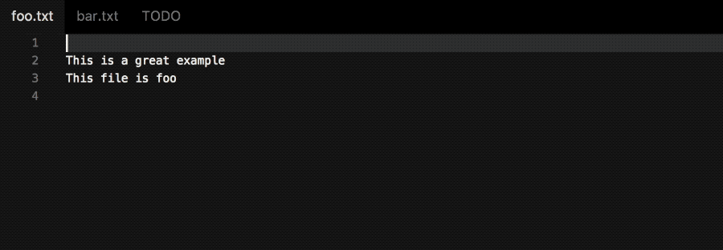

# VSC Diff

<p align="center">
	
</p>

Diff 2 opened files with ease. Because running `code --diff path1 path2` is too slow.

It requires that you run the `Install 'code' command in PATH` command.

It works in Code Insiders as well.

## Install

Run the following in the command palette:

```shell
ext install vscode-diff
```

## Usage

It adds 1 command to the command palette:

```js
Diff: File // Diff the current file against another one
```

## Demo



## Hints:

- **Diff against previous versions**: sometimes diffing against open files is not enough, try [Git File History](https://marketplace.visualstudio.com/items?itemName=fabiospampinato.vscode-git-history) for diffing against previous versions of the current file.

## License

MIT © Fabio Spampinato
